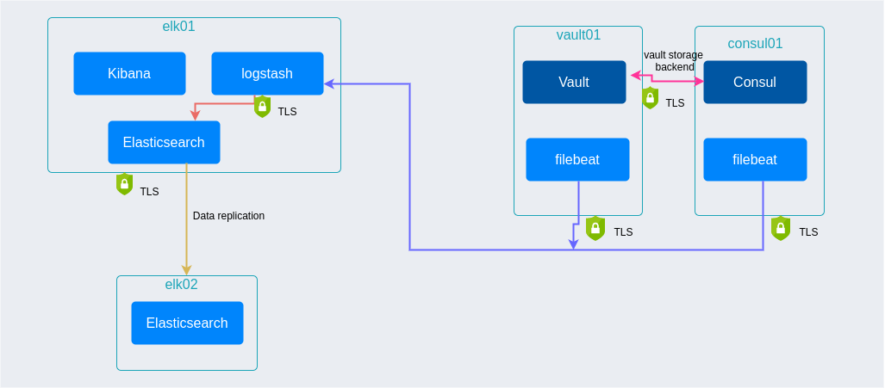

# vault-elfk

 
Demonstration of [Vault audit log](https://www.vaultproject.io/docs/audit) parsing and indexing using [Open Distro variant of Elasticsearch and Kibana](https://opendistro.github.io/for-elasticsearch/). This is because it provides important features like LDAP, role based access, and index management out of the box.
The stack also includes OSS version of Logstash and Filebeat (i.e Apache2 license).

This setup is built on OpenStack cluster https://github.com/Jibinxavier/Openstack-Homelab 

## Architecture 

### ELK Cluster

Elasticsearch cluster is a master-master setup (elk01 and elk02), where elk01 was initially configured to be the master node. 
This is not a highly available cluster as its prone to single node failure and underlying Openstack cluster is not at all fault tolerant
 
### Vault cluster

Simple single node Vault and Consul cluster. Where Consul is the storage backend for Vault. 

### Logstash Pipelines
There are two pipelines [logstash.conf](ansible/configs/logstash/templates/logstash.conf.j2) and [deadletter.conf](ansible/configs/logstash/templates/deadletter.conf.j2).

logstash.conf is the main pipeline. It contains parsing logic to send a log line to an index depending on identified type. Types could be vault operational log, vault audit log, caonsul agent log and more.

deadletter.conf leverages [DLQ](https://www.elastic.co/guide/en/logstash/current/dead-letter-queues.html) to keep track of log lines that failed parsing. And can be used to improve the logstash.conf.

## Configuration

The VMs and network configurations are created using Terraform. Ansible playbooks are used to install and configure Vault and Elasticsearch components.

Main Ansible roles are: 
- [certs-gen](ansible/roles/certs-gen) - to generate root and client certficates 
- [deploy-consul](ansible/roles/certs-gen)
- [deploy-elasticsearch](ansible/roles/deploy-elasticsearch)
- [deploy-filebeat](ansible/roles/deploy-filebeat)
- [deploy-kibana](ansible/roles/deploy-kibana)
- [deploy-logstash](ansible/roles/deploy-logstash)
- [deploy-vault](ansible/roles/deploy-vault)

### TODO

- Dashboards
- Improve separation of Vault audit logs and vault operational logs
- Better access control - not using admin